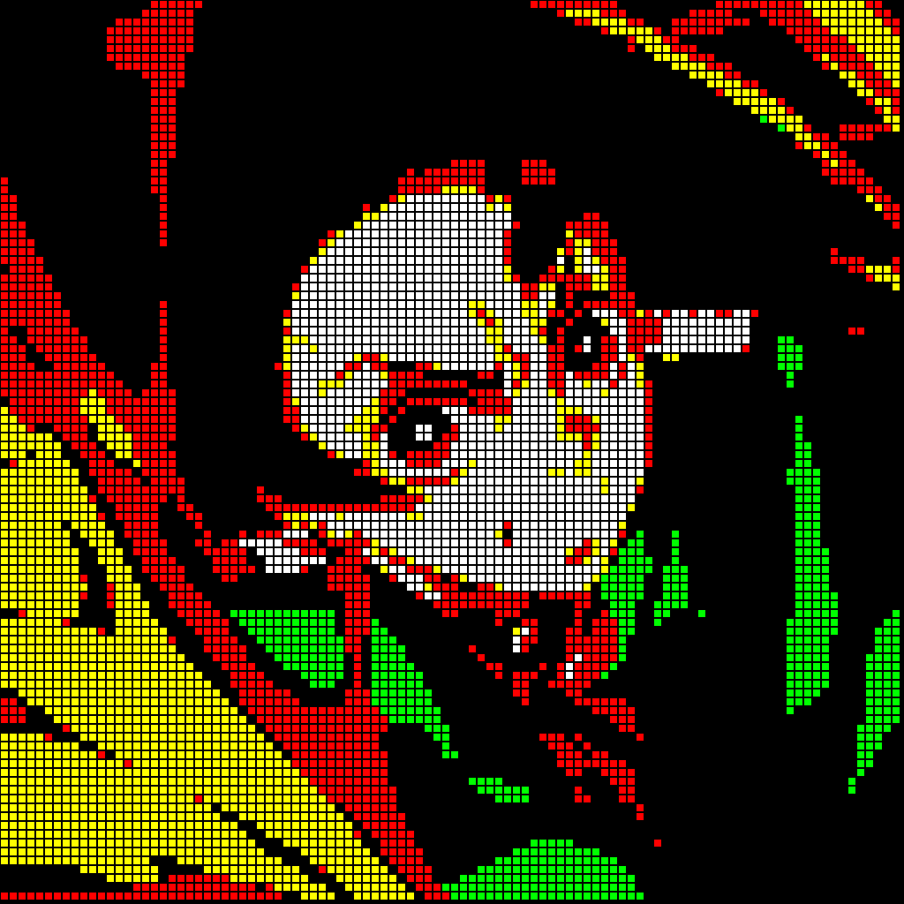

# Work in progress...

App for converting images to pixels (designed for hama beads)

- several options
- customized (...and available?) color pallete

[Live link](https://pixel-mew.netlify.app/)

## Example Image

## Example Pixel Image

## Example Pixel Image with grid

